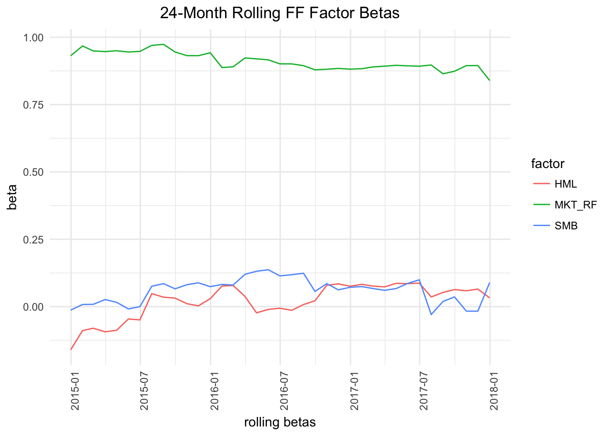
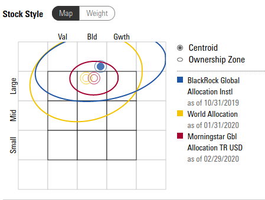
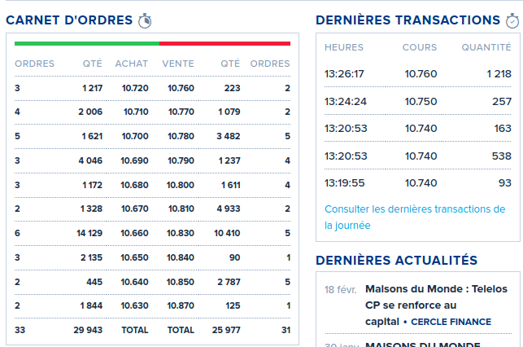
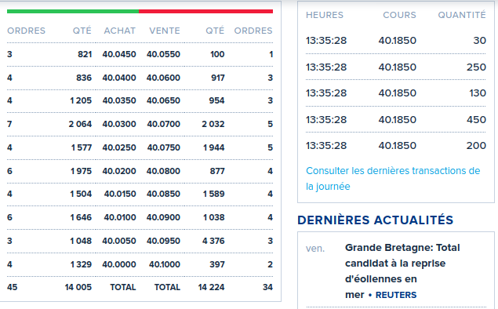
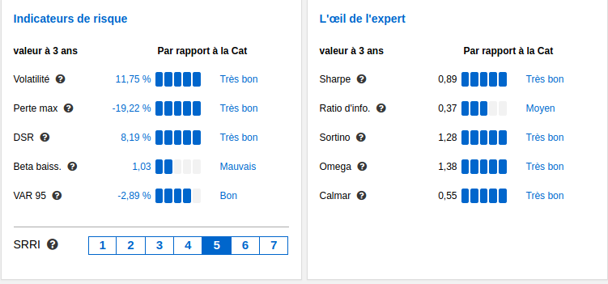
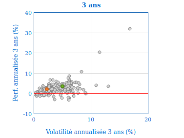
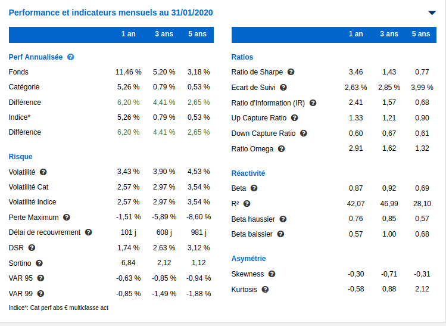

```{r setup, include=FALSE}
knitr::opts_chunk$set(echo = FALSE)
def.chunk.hook  <- knitr::knit_hooks$get("chunk")
knitr::knit_hooks$set(chunk = function(x, options) {
  x <- def.chunk.hook(x, options)
  ifelse(options$size != "normalsize", paste0("\n \\", options$size,"\n\n", x, "\n\n \\normalsize"), x)
})
```

```{r load-libraries, include=FALSE, echo=FALSE}
library(quantmod)
library(xts)
library(hornpa)
library(lubridate)
library(xtable)
library(PerformanceAnalytics)
library(TTR)
library(SuppDists)
library(lubridate)
library(roll)
library(Hmisc)
library(nFactors)
library(quadprog)
library(knitr)
library(kableExtra)
library(latex2exp)
library(FFdownload)
library(fPortfolio)
library(BLCOP)
library(mnormt)
library(riskParityPortfolio)


get.src.folder <- function() {
  path.expand("../GP/src")
}

get.data.folder <- function() {
  path.expand("../GP/data")
}

source(file.path(get.src.folder(), 'utils.R'))
source(file.path(get.src.folder(), 'FileUtils.R'))
```

## Droite de Marché des Capitaux

```{r cml, echo=FALSE, out.width = '100%', fig.cap="Droite de Marché des Capitaux"}
knitr::include_graphics("capital-market-line.pdf")
```

## MEDAF: Droite de Marché des Titres

```{r, capm, echo=FALSE, fig.cap="Droite de Marché des Titres", fig.height=5}
x <- runif(20, .5, 2)
y <- .02 + .03*x + rnorm(20,0,.0025)
plot(x,y, xlim=c(0, 2.5), ylim=c(0, .1), bty="no", pch=1, col="blue", xlab=expression(beta),
     ylab=expression(E(r)))
abline(a=.02, b=.03, col="red")
```

## APT (0)

Valorisation par Arbitrage


+ Rendement fonction linéaire d'un nombre limité de facteurs
+ Il y a assez de titres sur le marché pour créer des portefeuilles où le risque spécifique a été diversifié
+ Absence d'arbitrage

## Raisonnement par Arbitrage

## APT (1)
::: columns

:::: column
```{r, apt-1, echo=FALSE, fig.cap="Portefeuille diversifié"}
x <- runif(20, -2, 2)
y <- .02 + .03*x + rnorm(20,0,.0015)
plot(x,y, xlim=c(-2.5, 2.5), ylim=c(-.1, .1), bty="no", pch=1, col="blue", xlab=expression(F),
     ylab=expression(E(r)))
abline(a=.02, b=.03, col="red")
```
::::

:::: column
```{r, apt-2, echo=FALSE, fig.cap="Action Simple"}
x <- runif(20, -2, 2)
y <- .02 + .03*x + rnorm(20,0,.01)
plot(x,y, xlim=c(-2.5, 2.5), ylim=c(-.1, .1), bty="no", pch=1, col="blue", xlab=expression(F),
     ylab=expression(E(r)))
abline(a=.02, b=.03, col="red")
```
::::

:::

## APT (2)

::: columns

:::: column
```{r, apt-3, echo=FALSE, fig.cap="Opportunité d'arbitrage"}
x <- runif(20, -2, 2)
y <- .02 + .03*x + rnorm(20,0,.001)
plot(x,y, xlim=c(-2.5, 2.5), ylim=c(-.1, .1), bty="no", pch=1, col="blue", xlab=expression(F), ylab=expression(E(r)))
z <- .0 + .03*x + rnorm(20,0,.001)
points(x, z, pch=1, col="blue")
abline(a=.02, b=.03, col="red")
abline(a=.0, b=.03, col="green")
```
::::

:::: column
::::

:::


## APT (3)

::: columns

:::: column

$$
E(R_i) - R_f = \beta_i^1 (\bar{R}_1 - R_f) + \beta_2^1 (\bar{R}_2 - R_f) + \ldots
$$

::::

:::: column
::::

:::


## Modèle Fama-French

$$
R_{i,t} = \alpha_i + \beta_{i,M} R_{M,t} + \beta_{i, SMB} SMB_t + \beta_{i, HML} HML_t + e_{i,t}
$$

\begin{description}
\item[$R_i$] Excédent de rendement, titre $i$
\item[$R_M$] Excédent de rendement, marché
\item[$SMB$] "Small Minus Big": Facteur Capitalisation
\item[$HML$] "High Minus Low": Facteur Valorisation
\end{description}

## Modèle Fama-French

```{r, echo=FALSE, message=FALSE, fig.height=5, fig.cap="Facteurs Fama-French"}
FF.file <- "FFdownload.rda"
if(!file.exists(file.path(get.data.folder(),"FFdownload.rda"))) {
tempf <- tempfile(fileext = ".RData")
inputlist <- c("F-F_Research_Data_Factors", "F-F_Momentum_Factor","F-F_ST_Reversal_Factor","F-F_LT_Reversal_Factor")
FFdownload(output_file = tempf, inputlist=inputlist)
load(tempf)
save(tempf, file=file.path(get.data.folder(),"FFdownload.rda"))
}
load(file.path(get.data.folder(),"FFdownload.rda"))

fig <- exp(cumsum(FFdownload$`x_F-F_Research_Data_Factors`$monthly$Temp2["1960-01-01/",c("Mkt.RF","SMB","HML")]/100))
plotFF <- plot(fig[,"Mkt.RF"],main="Market",major.ticks = "years",format.labels="%Y",col="black",lwd=2,lty=1,cex=0.8)
plotFF <- lines(fig[,"SMB"],on=NA,main="SMB",col="darkgreen",lwd=2,lty=1,ylim=c(0,5),cex=0.8)
plotFF <- lines(fig[,"HML"],on=NA,main="HML",col="darkred",lwd=2,lty=1,ylim=c(0,15),cex=0.8)
plotFF
```

## Stabilité des Betas Fama-French (1)

Portefeuille:

+ SPY (S&P500)  25%
+ EFA (Actions ex-US) 25%
+ IJS (Small Cap Value) 20%
+ EEM (EM) weighted 20%
+ AGG (Obligations) 10%

## Stabilité des Betas Fama-French (2)

```{r FF-rolling, echo=FALSE, out.width = '100%', fig.cap="Betas Fama-French"}

```

## Influence du modèle Fama-French

```{r morningstar, echo=FALSE, out.width = '100%', fig.height=5, fig.cap="Diagramme Size/Value"}

```

## Autres Facteurs: Momentum

$$
R_{i,t} = \alpha_i + \beta_{i,M} R_{M,t} + \beta_{i, SMB} SMB_t + \beta_{i, HML} HML_t + \beta_{i,UMD} R_{UMD,t} + \ldots + e_{i,t}
$$

UMD: Up Minus Down

## Momentum et Liquidité (1)

```{r carnet-ordre-1, echo=FALSE, out.width = '100%', fig.height=4.5, fig.cap="Maisons du Monde"}

```

## Momentum et Liquidité (2)

```{r carnet-ordre-2, echo=FALSE, out.width = '100%', fig.height=4.5, fig.cap="Total"}

```

## Facteurs et Fouille de Données (Harvey et al.)

$$
R_i(t) - R_f(t) = \alpha_i + \beta_i(R_M(t) - R_f(t)) + \gamma_i F(t) + \epsilon_i(t)
$$

$$
\frac{\hat{\gamma_i}}{\sigma(\gamma_i)} \sim  \mbox{t-stat}
$$

Erreur Type I: Accepter un facteur alors qu'il n'est pas significatif.

## Exercise: Significativité de $\alpha$

+ $\alpha$ mensuel = 0,20%
+ $\beta$ = 1,2
+ $\sigma$ résiduel mensuel = 2%
+ $\sigma$ marché mensuel = 6%
+ 36 mois de données.

Est-ce que le gérant apporte une valeur ajoutée, ou bien est-il chanceux?

## Exercice: Valider le résultat précédent par simulation

+ Tirer un échantillon de $R(t)$ et $R_M(t)$ sous $H_0$
+ Estimer $\alpha$ par regression, en utilisant \texttt{apply}
+ Calculer la distribution empirique du ratio 
$$
\frac{\hat{\alpha_i}}{\sigma(\hat{\alpha_i})} \sim  \mbox{t-stat}
$$

## Black-Litterman (1)

+ Par défaut: Accepter les espérances de rendement implicites dans le 
portefeuille de marché, et investir dans ce portefeuille.
+ Exprimer des "vues" sur l'espérance de rendement de portefeuilles quelconques
+ Utiliser ces "vues"pour modifier les espérances de rendement et la structure de covariance des actifs.

## Black-Litterman (2)

View: IBM et Dell surperforme MS.

\tiny
```{r, echo=TRUE, message=FALSE}
pickMatrix <- matrix(c(1/2, -1, 1/2, rep(0, 3)), 
                     nrow = 1, ncol = 6 )
views <- BLViews(P = pickMatrix, q = 0.06,
                 confidences =  100, 
                 assetNames = colnames(monthlyReturns))
views
```
\normalsize

## Black-Litterman (3)

\tiny
```{r, echo=FALSE, message=FALSE}
priorMeans <- rep(0, 6)
priorVarcov <- MASS::cov.mve(monthlyReturns)$cov

marketPosterior <- posteriorEst(views = views, sigma = priorVarcov, mu = priorMeans, tau = 1/2)
marketPosterior
```
\normalsize

## Black-Litterman (4)

View: Le rendement moyen du secteur financier sera de 15%

\tiny
```{r, echo=TRUE}
finViews <- matrix(ncol = 4, nrow = 1, dimnames = list(NULL, c("C","JPM","BAC","MS")))
finViews[,1:4] <- rep(1/4,4)
views <- addBLViews(finViews, 0.15, 90, views)
views
```
\normalsize

## Black-Litterman (5)

\tiny
```{r, echo=TRUE}
marketPosterior <- BLPosterior(as.matrix(monthlyReturns), views,
                               tau = 1/2, 
                               marketIndex = as.matrix(sp500Returns),
                               riskFree = as.matrix(US13wTB))
marketPosterior
```
\normalsize

## Black-Litterman (6)

Portefeuille Tangent:

\tiny
```{r, echo=TRUE}
optPorts <- optimalPortfolios.fPort(marketPosterior, 
            optimizer = "tangencyPortfolio")
```
\normalsize

## Black-Litterman (7)

:::: columns

::: column

```{r, echo=FALSE, fig.cap="Prior Rdt/Risque"}
weightsPie(optPorts$priorOptimPortfolio)
```
:::

::: column
```{r, echo=FALSE, fig.cap="Posterior Rdt/Risque"}
weightsPie(optPorts$posteriorOptimPortfolio)
```
:::

::::

## Risk Budgeting

$$
\sigma(w) = w^T \Sigma w
$$

Contribution au risque de l'actif $i$:

$$
\mbox{RC}_i = \frac{w_i \left(\Sigma w \right)_i}{\sqrt{w^T \Sigma w}}
$$

## Risk Parity & Budgeting

Parity:

$$
\mbox{RC}_i = \frac{1}{N} \sigma(w)
$$

Bugeting:

$$
\mbox{RC}_i = b_i \sigma(w)
$$

## Cas Paticulier: $\Sigma$ diagonal

$$
\Omega = \sqrt{\mbox{diag}(\Sigma)}
$$
$$
w = \frac{\Omega^{-1}}{1^T \Omega^{-1}}
$$


## Risk Parity & Budgeting: Exemple.

```{r, eval=TRUE, echo=FALSE, warning=FALSE}
monthly.ret.file <- "./monthly.ret.rda"
tickers <- c("AAPL", "AMZN", "MSFT", "F", "SPY", "QQQ", "XOM", "MMM", "HD", "PG", "KO")
if(!file.exists(monthly.ret.file)) {
monthly.ret <- NULL
for(t in tickers) {
  p <- getSymbols(t, auto.assign = FALSE)
  tmp <- monthlyReturn(p[, 6])
  colnames(tmp) <- t
  if(is.null(monthly.ret)) {
    monthly.ret <- tmp
  } else {
    monthly.ret <- cbind(monthly.ret, tmp)
  }
}
monthly.ret <- removeNA(monthly.ret)
save(monthly.ret, file='monthly.ret.rda')
}
load(monthly.ret.file)
```


```{r, echo=TRUE}
Sigma <- cov(monthly.ret)
mu <- colMeans(monthly.ret)
rpp_naive <- riskParityPortfolio(Sigma, formulation = "diag")
rpp_vanilla <- riskParityPortfolio(Sigma)
rpp_mu <- riskParityPortfolio(Sigma, formulation = "rc-over-b-double-index",
                              mu = mu, lmd_mu = 1e-3,
                              w_ub = 0.16)     

w_all <- cbind("EWP"           = rep(1/nrow(Sigma), nrow(Sigma)),
               "RPP (naive)"   = rpp_naive$w)

```

## Risk Budgeting

```{r}
barplotPortfolioRisk(w_all, Sigma)
```

## Risk Budgeting

```{r}
w_all = cbind("RPP (vanilla)" = rpp_vanilla$w,
               "RPP + mu"      = rpp_mu$w)

barplotPortfolioRisk(w_all, Sigma)
```


## Attribution de Performance (1)

+ t=0: Achat d'une action à 50E
+ t=1: Dividende reçu: 2E, achat d'une action à 53E
+ t=2: Dividende reçu: 4E, valeur de marché d'une action: 54E

Rendement annuel?


## Quels Indicateurs de Risque?

```{r expert, echo=FALSE, out.width = '100%', fig.height=4.5, fig.cap="Indicateurs de Risque"}

```

## Quels Indicateurs de Risque?

+ Sharpe: $(r_P - r_f)/\sigma_P$
+ Treynor:$(r_P - r_f)/\beta_P$
+ IR: $\alpha_P / \sigma(e_P)$


## Diagramme Rendement / Risque 

```{r rdt-risque, echo=FALSE, out.width = '100%', fig.height=4.5, fig.cap="Couple Rdt/Risque"}

```


## Attribution de Performance: Timing

```{r rdt-risque-2, echo=FALSE, out.width = '100%', fig.height=4.5, fig.cap="Beta haussier/baissier"}

```

## Timing = Call sur le marché

## Attribution de Performance: Allocation et Selection

$i$: indice de la classe d'actif.

Benchmark

$$
r_B = \sum_i w_{Bi} r_{Bi}
$$

Portefeuille

$$
r_P = \sum_i w_{Pi} r_{Pi}
$$

## Attribution de Performance: Allocation et Selection

Contribution de la classe $i$ =

$$
\begin{aligned}
& w_{Pi} r_{Pi} - w_{Bi} r_{Bi}  = \\
& (w_{Pi} - w_{Bi}) r_{Bi}  \ \ \ \ \mbox{allocation} \\
+ & w_{Pi}(r_{Pi} - r_{Bi}) \ \ \ \ \mbox{selection} 
\end{aligned}
$$


## Exercice

Utiliser le package "riskParityPortfolio" et le dataset "monthly returns".

A partir de l'exemple: "A pratical example using FAANG price data", comparer par un backtest les performances et la composition d'un portefeuille tangent et d'un portefeuille "risk parity".

Ajouter des contraintes au portefeuille tangent:

+ Poids $<=$ 20%
+ Secteur Technologie $<=$ 30%


https://cran.r-project.org/web/packages/riskParityPortfolio/vignettes/RiskParityPortfolio.html

## Bibliographie

Grinhold, R.C. and Kahn, R. Active Portfolio Management, Mc Graw-Hill, 2000
